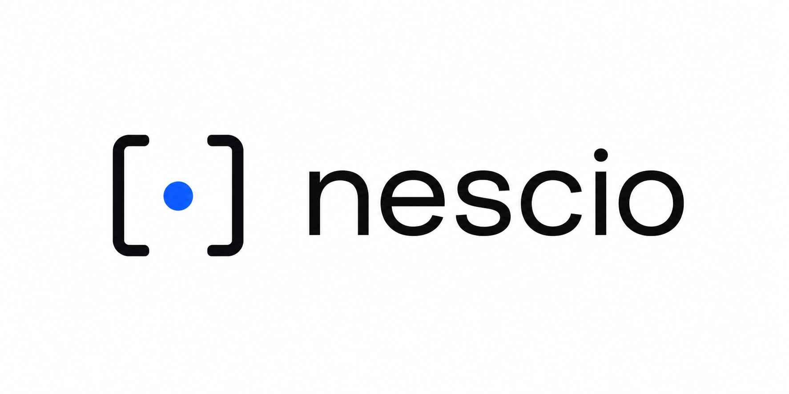

<p align="center">
  
</p>

<h1 align="center">nescioDB — the database that knows what it doesn't know</h1>

<p align="center">
  <a href="https://crates.io/crates/nescio"></a>
  <a href="https://docs.rs/nescio"></a>
  <a href="https://github.com/PyrraNet/nescioDB/actions/workflows/ci.yml"></a>
  <a href="LICENSE"></a>
  
</p>

<p align="center">
  <a href="https://pyrranet.github.io/nescioDB/"><b>Documentation</b></a> ·
  <a href="https://pyrranet.github.io/nescioDB/#tour">Five-minute tour</a> ·
  <a href="https://pyrranet.github.io/nescioDB/#http">HTTP API</a> ·
  <a href="https://pyrranet.github.io/nescioDB/#formats">File formats</a> ·
  <a href="https://docs.rs/nescio">Rust API</a>
</p>

---

**nescio** *(Latin: "I do not know")* is a **probabilistic database** for data that is uncertain, contradictory, and decaying — an embedded Rust library and HTTP/JSON server that stores ignorance as a first-class object. A field without evidence is not `NULL` — it is a region of maximal entropy. Evidence narrows regions, time widens them again, and the database can tell you which evidence to acquire next.

Instead of values, you store **claims**: who said what, when, and how reliable they are. Everything else — credible regions, entropy in bits, answers — is derived at query time. Every source has a half-life; old claims lose their grip on the data by physics, not by TTL.

## The verbs

| Verb | Answers |
|---|---|
| `bound` | What is known — credible region and entropy in bits |
| `sample` | One concrete, consistent world, deterministic under a seed |
| `resolve` | Which minimal-cost evidence would push entropy under a target |
| `find` | Which entities *certainly* / *possibly* lie in a range |
| `join` | Entity pairs matching a relation — each with a probability *and* a three-valued certainty, because joining two regions is itself uncertain |
| `certainly` | Three-valued predicates: `true` / `possible` / `false` |
| `watch` | Standing questions — "tell me when knowledge decays past this threshold", with the **knowledge horizon** (the exact date it will fire) predicted in advance, and Server-Sent Events from `nescio serve` |

## Use cases

Built for data that is inherently uncertain, contradictory, and decaying:

- **Lead & company data** — enrichment from sources of mixed reliability; freshness is physics, not an `updated_at` column
- **OSINT & investigations** — contradictory claims with provenance, and `resolve` tells you what to verify next
- **Sensor fusion** — noisy measurements as intervals, fused across sources with per-source reliability
- **Real-estate intelligence** — price regions instead of point guesses; comparable search as an uncertain join
- **Entity resolution & deduplication** — `join --op same` scores candidate duplicates with a probability *and* a certainty

## Quick start

```bash
cargo install nescio

nescio init mydb --template real-estate

nescio ingest mydb --entity villa_1 --slot price --interval 900000..1000000 \
       --source broker --at 2026-06-25

nescio bound mydb --entity villa_1 --slot price --at 2026-07-03
```

```
BOUND villa_1.price as of 2026-07-03
  region (95%): [570000, 1210000]
  entropy: 4.20 of 7.64 bits (knowledge 45%)
  MAP estimate: 905000
```

Ask again a year later — same command, `--at 2027-07-03` — and the region has widened on its own. Erase a source with `nescio forget-source`, and every derived region widens correctly: there is no aggregate that could forget to forget.

Because decay is deterministic, nescio can tell you **in advance** when it will stop knowing enough — and tell you the moment it happens:

```bash
nescio watch add mydb --name price_fresh --entity villa_1 --slot price --max-entropy 5.0
# watch "price_fresh" added
#   ok   price_fresh   villa_1.price  4.25 bits (threshold 5.00)  fires ~2026-08-10 without new evidence

nescio watch check mydb        # exits 2 when anything fired — cron-ready
curl -N localhost:7777/watches/events   # or subscribe: Server-Sent Events
```

Joins compare uncertain regions, so each match carries a probability and a certainty:

```bash
nescio join mydb --op approx --left price --right price --tol 50000   # comparable properties
nescio join mydb --op gt --left price --right price --certain          # A certainly dearer than B
nescio join mydb --op same --left city --right city                    # entity resolution: candidate duplicates
```

## As a server (HTTP/JSON API)

```bash
nescio serve mydb --port 7777
```

```bash
curl 'localhost:7777/bound?entity=villa_1&slot=price&at=2026-07-03'
```

All verbs over HTTP/JSON, usable from any language. One process owns the database; reads run in parallel, writes are exclusive.

Typed clients for [Python](clients/python/), [TypeScript](clients/typescript/) and [Java](clients/java/) wrap the verbs — all zero-dependency and single-file vendorable.

## As a Rust library

```rust
use nescio::prelude::*;
use nescio::time::now_unix;
use std::path::Path;

let db = Db::open(Path::new("mydb"))?;
let q = Query::new(&db, now_unix());

let bound = q.bound("villa_1", "price", 0.95)?;
println!("{:.2} bits", bound.entropy_bits);
```

## How it compares

- **vs. `NULL` in SQL** — `NULL` says only "no value". nescio says *how much* is unknown (entropy in bits), what is still credible (the region), and which evidence would shrink it. A classical relational database is the special case where every claim is an axiom and every region is a point.
- **vs. probabilistic databases** (MayBMS, Trio, BayesDB) — those attach probabilities to tuples in otherwise clean tables. nescio models the *evidence itself* — source reliability, decay, contradiction — and derives distributions at query time, so forgetting a source is exact, not approximate.
- **vs. TTL and cache expiry** — a TTL deletes at a cliff. Half-life decay widens uncertainty continuously: old data degrades gracefully instead of vanishing, and the database can report how stale is *too* stale for a given decision.

## Performance

Measured on an M-series MacBook, 200,000 entities / 400,000 evidence records (`cargo run --release --example bench`):

```
ingest (group commit, one fsync)   ~1.1M records/s
open / log replay                  ~1.2M records/s
bound                              4.5 µs  (8.6 µs with couplings)
resolve                            < 1 ms
```

The server runs reads in parallel; every write is durable before it is acknowledged.

## Storage

A database is a directory. Config is human-readable JSON; the evidence log is
a compact, append-only binary format (~2.6× smaller than JSONL, no parse cost
on replay). `nescio export` reconstructs readable JSONL any time, and `nescio
import` goes the other way.

```
mydb/
  schema.json     slots and couplings
  sources.json    reliability, half-life, axiomatic
  priors.json     shared priors
  watches.json    standing questions (only if you add some)
  log.bin         the evidence log (append-only binary)
```

## License

[MIT](LICENSE)
